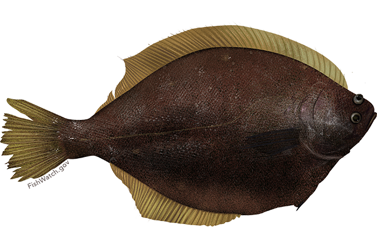

```{r, include=FALSE}
knitr::opts_chunk$set(echo = FALSE, warning=FALSE, 
                      error = FALSE, message = FALSE)
# https://stackoverflow.com/questions/25415365/insert-side-by-side-png-images-using-knitr
imgsize <- "100px"
```

```{r, include = FALSE, eval = FALSE}
#expressly for troubleshooting scripts, will not run in markdown (eval = FALSE)
# sections <- c("about")
# i<-1
# rmarkdown::render(paste0("./", sections[i], ".Rmd"),
#                 output_dir = "./docs/",
#                 output_file = paste0(sections[i], ".html"))
```

<center>

{width=`r paste(imgsize)`} {width=`r paste(imgsize)`} {width=`r paste(imgsize)`} {width=`r paste(imgsize)`}   {width=`r paste(imgsize)`} {width=`r paste(imgsize)`}

</center>

<br>

<div class = "row">
<div class = "col-md-5">

```{r}
# library(leaflet)
# library(leafpop)
# library(maps)
# library(magrittr)
# library(fontawesome) #devtools::install_github("rstudio/fontawesome")

places<-data.frame("place" = c("place 1", 
                               "place 2", 
                               "place 3", 
                               "place 4", 
                               "place 5"),
                   img = c("./img/yellowfin_sole.png", 
                           "./img/yellowfin_sole.png", 
                           "./img/yellowfin_sole.png",
                           "./img/yellowfin_sole.png", 
                           "./img/yellowfin_sole.png"), 
                   imgurl = c(
                     "https://www.fisheries.noaa.gov/species/yellowfin-sole",
                     "https://www.fisheries.noaa.gov/species/yellowfin-sole",
                     "https://www.fisheries.noaa.gov/species/yellowfin-sole",
                     "https://www.fisheries.noaa.gov/species/yellowfin-sole",
                     "https://www.fisheries.noaa.gov/species/yellowfin-sole"), 
                   "type" = c("p1", "p2", "p3", "p4", "p5"), 
                    "lat" = c(41.199017, 40.902866, 38.992836, 47.686254, 62.299624), 
                    "lng" = c(-73.928150, -73.125015, -77.031054, -122.253657, -171.262273))

imgs <- places$img

places %>%
  leaflet(width = "100%") %>% 
  addProviderTiles(providers$Esri.NatGeoWorldMap) %>%
  # addTiles() %>%
  addCircleMarkers(
    fillOpacity = 0.8, 
    radius = 10,
    color = "#34304a",
    # addAwesomeMarkers(icon = ~icoLst[type], 
    label= ~place, 
    lng = ~lng, 
    lat = ~lat,
    popup = popupImage(img = imgs, width = 150))

```

</div>


<div class = "col-md-7">

```{r}
# insert bio
insert <- readtext::readtext(file = "./data/bio.docx")
```

`r insert$text`

</div>

</div>

<br>


